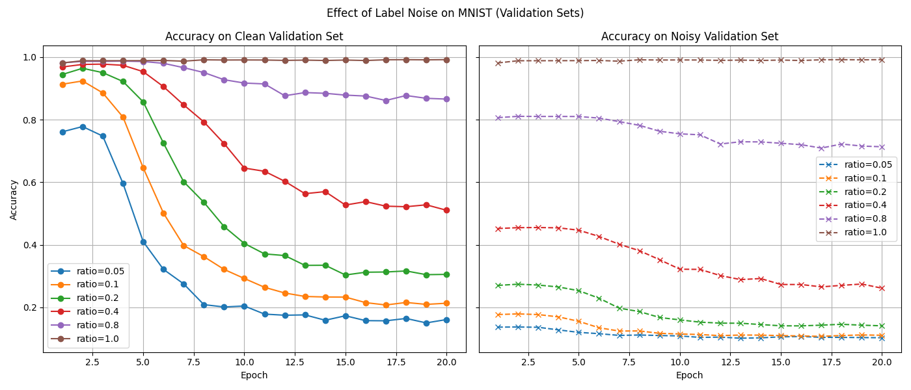
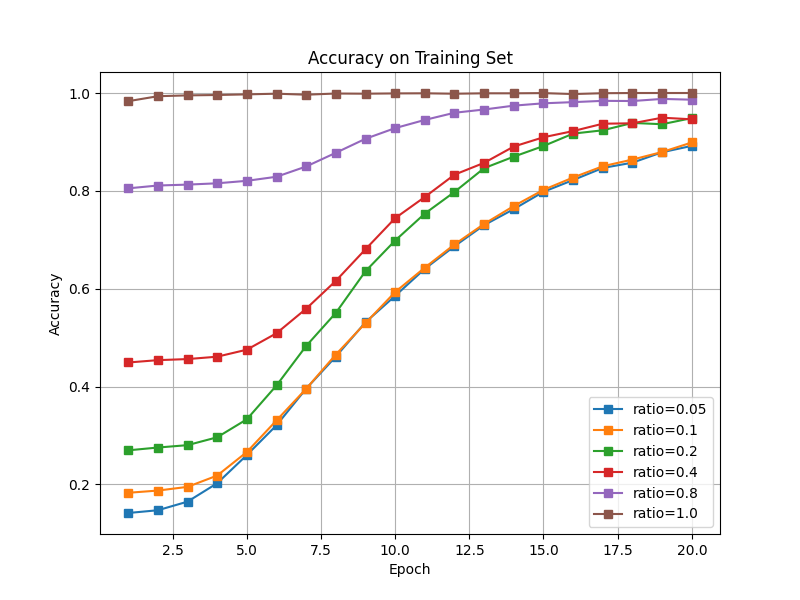

# 为什么学生能比老师“更出色”？一个关于神经网络学习的趣闻

本项目通过一个生动的比喻，探讨了一个深度学习中的有趣现象：一个“学生”（神经网络）如何从一个有时会犯错的“老师”（带有噪声标签的数据集）那里学习，甚至在某些阶段比“老师”表现得更出色。

## 故事背景：一个不那么完美的老师

在现实世界中，我们用来训练模型的数据（“教科书”）往往不是100%完美的，里面可能掺杂着错误的标签（“印刷错误”）。我们的“老师”（训练过程）会不加分辨地使用这些有错误的“教科书”来教导“学生”（神经网络模型）。

这个实验的核心问题是：

1.  如果“老师”教的知识错误百出，这位“学生”的真实水平会受到多大影响？
2.  “学生”在学习过程中，是如何处理这些错误知识的？是忽略它们，还是把它们死记硬背下来？

## 实验设置：我们的“课堂”

*   **“学生”**: 一个求知欲很强的卷积神经网络 (CNN)。
*   **“教科书”**: [MNIST](http://yann.lecun.com/exdb/mnist/) 手写数字数据集。
*   **“教学方法”**:
    1.  我们人为地在“教科书”（训练集）中引入不同比例的“印刷错误”（错误的标签）。例如，`ratio=0.4` 意味着教科书里只有 40% 的答案是正确的，剩下 60% 都是错的。
    2.  让“学生”使用这些质量不同的“教科书”进行学习。
    3.  在每个学习阶段（Epoch）后，我们会进行**三种**“考试”。

## 考试结果：学生表现如何？

实验结果通过一系列图表（`show.png`）展示。我们为“学生”准备了三种“考试”：

*   **“开卷考试（复习教科书）”**: 直接在学过的“教科书”（训练集）上进行测试，考察学生的记忆力。
*   **“校外大考（真实能力）”**: 在一本完全正确的、全新的习题集（干净的测试集）上测试学生，检验其泛化能力。
*   **“课堂测验（模拟能力）”**: 在一本同样充满错误的习题集（带噪声的测试集）上测试学生，检验其对老师所教知识的模拟程度。





从考试结果中，我们可以看到：

1.  **惊人的记忆力：学生把教科书（包括错误）背得滚瓜烂熟**:
    新增的“开卷考试”结果图显示，无论“教科书”质量有多差，学生的考分都迅速接近100%。这有力地证明了“学生”具有超强的记忆力，它把学过的内容，不论对错，全都“死记硬背”了下来。

2.  **“差老师”确实会带出“差学生” (校外大考)**:
    “教科书”里的错误越多（`ratio` 越小），“学生”在“校外大考”中的最终成绩就越差。这说明，长期死记硬背错误知识，会严重损害学生的真实解题能力。

3.  **学生“超越”老师的时刻 (校外大考的关键洞察)**:
    在所有包含错误的学习过程中 (`ratio < 1.0`)，学生的“大考”成绩一开始是上升的，甚至能达到不错的水平，但随后会逐渐下降。
    这揭示了最有趣的一点：在学习初期，“学生”非常聪明，能够透过“老师”的种种错误，抓住知识的本质和真实规律。**在这个阶段，学生举一反三，表现出了比TA所学的、充满错误的知识“更出色”的能力。**
    然而，随着学习的深入，这位“学生”开始钻牛角尖，把“老师”犯的每一个错误都当成知识点记了下来（过拟合于噪声），最终导致其解决实际问题的能力下降。

## 结论

这个实验生动地展示了神经网络的两个特点：它既有强大的归纳和泛化能力，能从不完美的数据中发现规律；但它也非常“老实”，会不加甄别地记忆和拟合训练数据中的所有细节，包括其中的噪声和错误。新增的训练集准确率图更加强化了它“死记硬背”的倾向。

## 如何运行

1.  确保你已经安装了必要的 Python 库：

    ```bash
    pip install torch torchvision matplotlib
    ```

2.  执行脚本：

    ```bash
    python run.py
    ```

    脚本会自动下载 MNIST 数据集，并开始进行训练和评估。实验结束后，会显示结果图表。