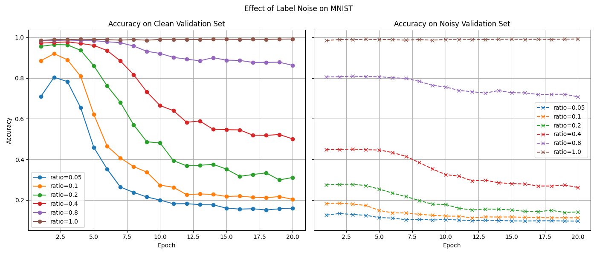

# 深度学习中的标签噪声效应实验

本项目通过一个在 MNIST 数据集上的图像分类实验，直观地展示了深度学习模型（特别是卷积神经网络）对训练数据中标签噪声的敏感性。

## 实验目的

在真实的生产环境中，数据集的标签往往不是 100% 准确的，可能包含各种错误。本实验旨在探究：

1.  不同比例的标签噪声对模型在 **干净数据集** 上的泛化能力有多大影响。
2.  深度神经网络在训练过程中是如何“学习”并“记忆”这些错误的噪声标签的。

## 实验设置

*   **数据集**: [MNIST](http://yann.lecun.com/exdb/mnist/) 手写数字数据集。
*   **模型**: 一个简单的卷积神经网络 (CNN)。
*   **方法**:
    1.  人为地对 MNIST 训练数据集引入不同比例的标签噪声。例如，“ratio=0.4”意味着训练集中只有 40% 的标签是正确的，其余 60% 是随机生成的错误标签。
    2.  使用这些被不同程度“污染”的数据集分别训练同一个 CNN 模型。
    3.  在训练的每个周期 (Epoch) 结束后，在 **完全干净的测试集** 和一个 **同样被污染的测试集** 上评估模型的准确率。

## 实验结果与结论

实验结果通过下图展示：



从图中可以得出以下关键结论：

1.  **标签噪声严重损害模型的泛化能力**: 左图显示，训练数据中的噪声越多（`ratio` 越小），模型在干净数据上的最终表现就越差。
2.  **神经网络会过拟合于噪声**: 在所有包含噪声的实验中（`ratio < 1.0`），模型的准确率在训练初期上升后，会随着训练的继续而逐渐下降。这清晰地表明，模型在学习到数据的真实模式后，会开始“死记硬背”那些错误的标签，导致其对真实世界的判断能力下降。

这个现象证明了在处理可能包含标签错误的现实世界数据时，需要采用更鲁棒的训练策略或进行数据清洗，以防止模型过拟合于噪声。

## 如何运行

1.  确保你已经安装了必要的 Python 库：

    ```bash
    pip install torch torchvision matplotlib
    ```

2.  执行脚本：

    ```bash
    python run.py
    ```

    脚本会自动下载 MNIST 数据集，并开始进行训练和评估。实验结束后，会显示结果图表。
